# 优化后程序化 BranchUnit 生成技术路线 V1

> **LEGACY / 历史方法快照。** 本文记录固定槽位、固定 L1 数量及早期 Stage4/5
> 路线，不是当前生产方法。当前唯一生产入口与真实链路见 `README.md` 和
> `PAPER_A_ENGINEERING_HANDOFF_V1.md`，不得以本文作为 Paper A 的方法依据。

## 1. 技术路线定位

这份文档描述的是当前程序在完成规则优化后，如何从给定主干生成多个 BranchUnit。它不是编辑器学习流程、修改记录或数据提取说明。

当前生成器属于完整研究路线中的 `P0 -> L1` 结构生成模块：

`结构原型 P0 -> 多 BranchUnit 结构几何 -> 可编辑结构 SVG -> 后续高质量渲染`

本轮已经实现的是“主干约束下的多 BranchUnit 结构生成”。叶片、芽、卷头、最终青花渲染以及完整 BranchUnit SVG 封装不属于当前已完成范围。

## 2. 当前生成目标

输入一条周期主干及其花位、边界和形态分析，程序一次生成一组共同成立的 BranchUnit，而不是逐条独立补枝。

每个 BranchUnit 的基本结构为：

`一条 L1 主枝 + 零至两条 L2 子枝 + 父子拓扑 + 占用几何`

当前目标是同时满足：

- 根位沿主干形成有节奏但不均匀的分布；
- L1 具有自然、非模板化的明显弯曲；
- 长、中、短枝形成层次；
- 一部分 Unit 只有 L1，一部分有单 L2，一部分有双 L2；
- L2 从父枝中段自然分出，不集中在远端，不彼此拥挤；
- 不同 Unit 在单周期和相邻周期中不相交，并保留必要空隙；
- 角色标签不强制决定造型，不要求每个 Unit 必须绕花或托花。

## 3. 运行时总链路

```mermaid
flowchart LR
    A["P0 主干、花位、周期边界"] --> B["主干采样与局部坐标分析"]
    B --> C["L1 槽位规划"]
    C --> D["每槽位生成 L1 几何候选"]
    D --> E["L1 硬约束过滤"]
    E --> F["全局 L1 集合求解"]
    F --> G["冻结 7 条 L1"]
    G --> H["为每条 L1 展开 BranchUnit 候选"]
    H --> I["Unit 内相交与净空过滤"]
    I --> J["建立跨 Unit 冲突图"]
    J --> K["精确层级混合的全局选择"]
    K --> L["结构 JSON 与周期预览"]
    L --> M["人工视觉判断"]
```

生产链分为四个核心阶段：

1. 主干分析与 L1 槽位规划；
2. L1 候选生成和全局布局求解；
3. 以冻结 L1 为核心展开完整 BranchUnit；
4. 在整幅构图上选择一组互不冲突的 Unit。

## 4. 输入与统一几何表示

### 4.1 正式输入

运行时消费以下结构资源：

- `strict_p0_v2.json`：主干、花位和周期结构原型；
- `prototype_analysis.json`：主干采样、切线、候选挂载区和花位保护区；
- `morphology_profile.json`：SW 原型的形态类别；
- `fixed_visual_prior.json`：枝长、根位节奏和子枝几何的基础统计；
- V2 参数资源：L1 曲率、L2 挂载、层级比例和净空参数；
- seed：控制同一原型下的可复现变化。

这些参数在运行时是已经冻结的生成资源。程序直接消费它们生成几何，不在生成过程中重新学习或拟合编辑案例。

### 4.2 周期坐标与主干参数

- 单元横向使用周期归一化坐标；
- 主干位置使用弧长参数 `s ∈ [0,1)`；
- 任意根位由 `root_s` 映射到主干点 `P(s)`；
- 主干局部切线记为 `T(s)`；
- 左右法向记为 `N_left(s)`、`N_right(s)`；
- 所有起步方向、外伸方向和子枝开口都在这个局部坐标系中计算。

周期边界不是事后裁切。相交和净空检查会同时考虑 `x-1`、`x`、`x+1` 三个重复位置。

### 4.3 曲线表示

L1 和 L2 最终都表示为三次 Bézier 段：

`B(t) = (1-t)^3 P0 + 3(1-t)^2t P1 + 3(1-t)t^2 P2 + t^3 P3`

每条曲线同时保存：

- Bézier 控制点；
- 离散中心线；
- 父曲线 ID；
- 父曲线挂载分数；
- 层级与转向；
- 实际长度；
- 用于冲突判断的占用管线。

## 5. 阶段 A：L1 槽位规划

### 5.1 数量与根位节奏

程序先确定整个 unit 需要多少条 L1，再规划槽位。当前 SW1-3 的正式配置为 7 个 L1 槽位。

每个槽位包含：

- 首选 `root_s`；
- 首选主干侧；
- 槽位顺序；
- 弱角色元数据；
- 对应的长度层次候选。

根位不是等距排列。首选位置来自当前冻结的根位节奏参数，再由 seed 产生的小幅 `flow_phase` 做整体相位移动，从而保持节奏同时产生案例变化。

### 5.2 全局变化量

每个 `prototype + seed` 只生成一组全局变化量：

- `openness`：整体开合；
- `sweep_amplitude`：扫掠幅度；
- `asymmetry`：上下或左右不对称；
- `flow_phase`：根位节奏相位；
- `curl_energy`：弯曲能量。

这些量对整个构图共同生效，避免每条枝各自随机造成风格破碎。

## 6. 阶段 B：L1 候选生成

### 6.1 候选展开维度

每个槽位在允许的主干挂载区域内展开候选：

`候选区域 × root_s × 主干侧 × 沿主干前后方向 × 长度层次 × 曲率变量`

根点由主干采样得到，目标点在局部坐标中构造：

`target = root + a · T(s) + b · N(s)`

其中 `a` 控制顺着主干的助跑与推进，`b` 控制离开主干后的外伸距离。

### 6.2 L1 起步与弯曲

L1 的基本运动顺序是：

`沿主干切线起步 -> 向空白侧转出 -> 形成主要弯曲 -> 末端释放或回收`

控制点由以下无坐标参数共同确定：

- 起点控制柄 / 根端弦长；
- 终点控制柄 / 根端弦长；
- 起始控制柄相对弦向的偏角；
- 末端控制柄相对弦向的偏角；
- 弓高、长度层次和最大外扩范围。

程序不先指定“这条必须是 C、那条必须是 S”，也不复制编辑器中的绝对坐标。C 形或 S 形是控制点组合产生的结果，不是固定形状模板。

### 6.3 单条 L1 硬过滤

候选在进入全局求解前检查：

- 起步是否同时具有切向连续性和向外分离；
- 目标是否落在周期审查窗口和垂直画布内；
- 离开根位后是否再次碰撞主干；
- 是否提前进入花位保护区；
- 与自身周期副本是否冲突；
- 长度是否低于结构下限；
- 垂直跨度与离主干最大距离是否过大。

失败候选被剔除，不做自动修补或扩大随机重试。

## 7. 阶段 C：全局 L1 集合求解

L1 不是逐槽位贪心落笔。程序使用确定性的全局 beam set solver，逐步组合各槽位候选。

### 7.1 两条 L1 的兼容条件

任意两条候选必须同时满足：

- 周期根位距离大于下限；
- 本周期及相邻周期的最小曲线距离大于下限；
- 不发生曲线相交。

在硬约束成立后，近距离同向滑行、根位节奏和终端方向协调可以增加组合分数。

### 7.2 整组构图评价

完整 L1 集合按结构关系评价：

- 根位覆盖和节奏；
- 目标空间覆盖；
- 长、中、短长度混合；
- 曲率分布与弯曲差异；
- 起步切向一致性；
- 垂直范围和主干外扩控制；
- 不同曲率参数的复用上限；
- 花位附近的软空间关系。

求解完成后得到 7 条按 `root_s` 排序的正式 L1。此后 L1 控制点冻结，后续阶段只能在其上挂载子枝，不能为了容纳 L2 再修改 L1。

## 8. 阶段 D：BranchUnit 候选展开

### 8.1 每个槽位的完整候选类型

每条冻结 L1 都生成三种层级类别：

- `L1-Only`：只有主枝；
- `Y-C`：主枝加一条 L2；
- `Y-2C`：主枝加两条 L2。

每类再提供若干参数层次，例如紧凑、开放、错位或嵌套。每个槽位都拥有三种层级选择，角色标签不限制它只能使用某一种结构。

### 8.2 L2 挂载

单 L2 使用一个父曲线弧长分数；双 L2 使用“挂载中心 + 两点分离距离”共同确定位置。

当前 SW1-3 参数的典型中心关系为：

- 单 L2 常落在父 L1 的中段附近；
- 双 L2 的两个根位明显拉开；
- 挂载区限制在父枝有效中段，避免贴根和全部堆到末端。

### 8.3 L2 几何

在挂载点重新计算父 L1 的局部切线，L2 以一定开口角离开父枝。L2 长度由父枝长度、层级密度和长短比例共同决定。

子枝有两类运动原语：

- 单弯曲 C：一段三次 Bézier，完成离枝、外伸和回收；
- 转向 S：两段连续 Bézier，先向一侧展开，再反向释放。

同一个双 L2 Unit 中，两条子枝默认采用相反或错位方向，形成清楚的父子层级，而不是鸡爪式同点放射。

### 8.4 Unit 内过滤

完整 Unit 生成后检查：

- 子枝根点是否真正位于父枝；
- 子枝起步是否立即离开父枝；
- 双子枝挂载间距；
- 双子枝整条曲线之间的最小净空；
- Unit 内自相交；
- 与主干的非根接触；
- 花位保护区侵入；
- 周期副本冲突。

不合法的完整 Unit 保留在候选 inventory 中但标记为不可选，方便观察失败类型；正式选择器只消费合法候选。

## 9. 阶段 E：跨 Unit 冲突图与全局选择

### 9.1 冲突图

把每个合法 BranchUnit 作为一个节点。若两个 Unit 不能同时出现，就建立冲突边。冲突来源包括：

- 不同 Unit 的任意曲线相交；
- 一个 Unit 的 L2 过度靠近另一个 Unit 的 L1 或 L2；
- 相邻周期平移后发生相交或净空不足。

这里检查的是完整 BranchUnit，而不是只检查 L1 中心线。

### 9.2 层级密度目标

当前 7 个槽位的正式层级混合为：

- 2 个 `L1-Only`；
- 3 个单 L2 Unit；
- 2 个双 L2 Unit。

总计为 7 条 L1 和 7 条 L2。这个混合避免“所有枝都是一级”以及“每条主枝都长满二级枝”两个极端。

### 9.3 确定性回溯选择

选择器按候选稀缺程度、层级轮换顺序、参数层次和冲突度排序，执行确定性约束回溯：

1. 每个槽位必须选一个完整 Unit；
2. 已选 Unit 之间不能存在冲突边；
3. 最终层级计数必须精确等于 `2/3/2`；
4. 找到第一组完整合法组合后停止。

它不对渲染图做自动审美打分，也不通过删枝、补枝或事后改曲线把失败结果修成通过。

## 10. 角色与花位的当前处理

support、wrap、balance、frontier、ordinary 等标签目前是弱兼容元数据，不是独立几何模板。

当前生成逻辑是：

- 所有槽位共享同一套 L1 几何机制；
- 所有槽位都可以选择 L1-only、单 L2 或双 L2；
- 花位保护区用于避免穿花和控制呼吸空间；
- 花位接近度可以作为软构图关系；
- 不强制某条枝必须托花、包花或形成明显 balance 角色；
- 不运行 R 区域规划。

这样保留整体藤蔓关系，同时避免角色规则压过枝条本身的流向和节奏。

## 11. 当前正式输出

### 11.1 已实现输出

当前整套 BranchUnit runner 输出：

- `unit_candidate_inventory.json`：所有完整 Unit 候选及父子拓扑；
- `candidate_conflict_graph.json`：跨 Unit 冲突关系；
- `global_unit_selection.json`：最终七个 Unit 及全部 Bézier 控制点；
- `global_unit_selection.png`：单周期结构预览；
- `global_unit_selection_triple_repeat.png`：三周期连续性预览；
- 候选图集和联系表。

`global_unit_selection.json` 是当前完整 BranchUnit 的结构真值。它包含生成可编辑 SVG 所需的控制点、层级和父子关系。

### 11.2 尚未接入的输出

Stage 3B 已能单独导出 L1 SVG，但当前 `run_edit_feedback_branch_units_v2.py` 还没有把最终 L1+L2 选择封装成完整可编辑 SVG。

因此下一步输出工程应是：

`global_unit_selection.json -> 语义分组的完整 BranchUnit SVG -> 编辑器载入`

这一步只负责格式化现有正式几何，不能重新生成、重选或修改曲线。

## 12. 当前实现入口

| 阶段 | 生产代码 | 职责 |
|---|---|---|
| 主干分析 | `prototype_analysis.py` | 主干采样、切线、候选挂载区、花位保护区 |
| L1 生成 | `global_l1_flow.py` | 槽位、候选、过滤、全局 L1 集合求解 |
| L1 批量运行 | `run_stage3b_l1_flow.py` | 运行 Stage 3B 并导出 L1 结构预览 |
| BranchUnit 展开 | `branch_unit_grammar_v1.py` | L1-only、单 L2、双 L2 候选与 Unit 内检查 |
| 全局选择 | `stage5_global_unit_selection.py` | 冲突图、层级目标和确定性回溯 |
| 最终运行入口 | `run_edit_feedback_branch_units_v2.py` | 串联 Stage 4/5 并输出最终结构包 |
| 最终预览 | `render_stage5_global_selection.py` | 单周期与三周期 PNG 渲染 |

## 13. 这条技术路线的核心变化

优化后的生成器不再是：

`在主干上逐条随机补枝 -> 每条独立避让 -> 结果碰撞后再删改`

而是：

`先规划整组 L1 -> 全局选择共同成立的主枝 -> 以每条 L1 为核心生成完整 BranchUnit -> 在完整 Unit 层面解决相交、净空和密度 -> 输出整组结构`

真正的结构原语已经从“单条曲线”变成“完整 BranchUnit”，全局选择对象也从局部线段变成完整父子枝组。这是当前程序化生成路线最关键的技术基础。
