# 动态 BranchUnit 整套优化机制 V1

状态快照：2026-08-16  
适用目录：`D:\sdxl\chanzhi_sw_clean_oldmain_opt\experiments\branch_unit\dynamic`  
当前视觉关口：5B、5C、5D、5E、5F 已全部获用户视觉确认（2026-08-16），机制已冻结

## 1. 文档用途与事实优先级

本文整理当前动态缠枝结构生成的完整优化机制，包括：

- 已经稳定并进入正式生产链的结构基础；
- 5A、5B、R0-R6、5C、5D 的真实实现与确认状态；
- 尚未实施的 5E、5F；
- 已经被否定或被新机制替代、不得重新启用的旧路线；
- 后续继续实现时应遵守的数据流、阶段边界和验收标准。

发生冲突时，当前事实按以下顺序判断：

1. 用户最近的明确确认或否定；
2. 本文记录的当前唯一生产链；
3. 当前活跃代码和阶段合同；
4. 当前正式运行产物；
5. 更早的规划文档、旧流程图和历史产物。

特别说明：

- `IMPLEMENTABLE_DYNAMIC_BRANCHUNIT_STRATEGY_V1.md` 中的固定数量后再构造槽位、经验 gap 槽位等内容，已被 R0-R5 的公共候选池机制替代；
- `PROTOTYPE_ROUTING_AND_DOMAIN_GENERATION_FLOW_V1.drawio` 中的“根位密度场”节点是早期表达，当前正式机制不建立二维密度场；
- `README.md` 主要记录早期 Stage 0-4，未覆盖最新 5A-5D 状态；
- 历史文件保留作证据，但不能覆盖本文的当前机制。

## 2. 总目标与明确边界

### 2.1 总目标

系统需要在保持 SW 原型身份的前提下，使下列结构变量能够分别控制并真实传导到最终 BranchUnit：

1. 选择哪个原型及其领域规则；
2. 主干如何变化；
3. 花位是否以及如何变化；
4. 花朵如何与主干或承花枝建立关系；
5. 普通 L1 的数量和根位如何响应当前构图；
6. 少量局部二级分叉如何形成繁简重点；
7. 最终全原型、跨 seed 输出如何保持结构合法与视觉可读。

核心不是制造更多随机曲线，而是形成：

```text
原型规则
→ 当前主干
→ 当前花位与承花关系
→ 当前可行普通 L1 集合
→ 少量局部复杂结构
→ 正式全局选择
→ 最终 BranchUnit
```

### 2.2 当前程序化系统只负责结构骨架

当前范围包括：

- 周期主干；
- 花朵结构占位；
- 正式承花枝；
- 普通 L1；
- 后续 5E 中极少量、结构明确的 L2 分叉；
- 周期连续、真实挂接、相交与净空控制。

当前范围不包括：

- 叶片生成；
- 膨大根茎或装饰性枝端造型；
- 用大量 L2/L3 填满空间；
- 扩散模型的纹理、色彩和器物渲染。

叶片与膨大形态由后续渲染大模型完成。程序化阶段只保留足够清晰的结构接口。

## 3. 当前唯一正式生产主链

```mermaid
flowchart LR
    A["输入需求或显式 prototype_id"] --> B["5A 原型路由与 PrototypeStrategy"]
    B --> C["production_seed 拆分四个 seed 域"]
    C --> D["5B 主干全局波形变体"]
    D --> E["5C 花位状态：仅 SW3 可变"]
    E --> F["花朵关系优先：生成并冻结正式挂接"]
    F --> G["重新分析当前 StrictP0 变体"]
    G --> H["R1 公共普通 L1 候选池"]
    H --> I["R2 单候选机械过滤"]
    I --> J["R3 候选对冲突关系"]
    J --> K["5D 密度档位与 R4 整体集合选择"]
    K --> L["Stage3 正式普通 L1 lanes"]
    L --> M["Stage4 BranchUnit 候选"]
    M --> N["Stage5 全局选择"]
    N --> O["正式结构渲染"]
    O --> P{"人工视觉确认"}
```



严格数据流为：

```text
source input
→ PrototypeStrategy
→ StrictP0 backbone variant
→ final flower layout
→ frozen flower mounts
→ current PrototypeAnalysis
→ count-independent common L1 pool
→ mechanical rejection
→ pair conflict graph
→ density-conditioned common-set solve
→ canonical Stage3 lanes
→ Stage4 Unit inventory
→ Stage5 selection
→ formal render
```

任何新增策略只有进入这条链并改变正式 `lanes`、Unit inventory、Stage5 selection 和正式图，才算完成。

## 4. 五个原型的领域规则

原型由语义条件或显式 `prototype_id` 选择，seed 不负责改变原型类别。

| 原型 | 领域身份 | 花位 | 花朵关系 | 普通 L1 风格 |
|---|---|---|---|---|
| `proto_sw_1_1` | SW1 波谷承托、偏密 | 固定原型关系 | 每朵花一根谷侧承托枝 | 短枝较多、频繁交替 |
| `proto_sw_1_3` | SW1 波谷承托、偏疏 | 固定原型关系 | 每朵花一根谷侧承托枝 | 少量长扫枝、疏朗不对称 |
| `proto_sw_2_3` | SW2 轴线贯穿 | 固定原型关系 | 花是主干视觉元素，不生成承托枝 | 主扫枝主导、沿轴线两侧组织 |
| `proto_sw_3_1` | SW3 切线远伸、单花 | 可变 | 远端根区延伸到花下 | 轻量、服从终端方向 |
| `proto_sw_3_2` | SW3 切线远伸、双花 | 可变，双花联合状态 | 两条远端承花路径 | 中等密度、上侧强调 |

共享硬规则包括：

- 周期局部坐标；
- 父曲线切线/法线局部标架；
- 花区保护；
- 承花关系优先；
- 主干、L1、Unit 与周期副本无非法相交；
- 最小可见净空；
- 结构合法不等于视觉通过。

## 5. Seed 域与可控变量

一个 `production_seed` 拆分为四个独立域：

| Seed 域 | 当前职责 |
|---|---|
| `backbone_seed` | 5B 主干变体方向与组合 |
| `flower_seed` | 5C 的 SW3 单花/双花联合花位状态 |
| `branch_seed` | 普通 L1 连续几何候选、5D 密度状态和组合节奏 |
| `unit_seed` | Stage4 Unit 细节；后续 5E 的少量局部复杂落位 |

受控对照可以显式覆盖其中一个 seed 或密度档位，但正式生产默认由 `production_seed` 派生。

不得通过换 seed 重试解决当前 seed 的结构失败。

## 6. 已完成的结构基础

### 6.1 StrictP0、分析与形态分类

已经具备：

- 五个 SW 原型的 `StrictP0 v2` 输入；
- 周期主干弧长、切线、波峰波谷、转折、长坡分析；
- 花朵与主干的最近关系和保护区；
- 一维合法挂接区间；
- 三类花朵关系：SW1 谷位承托、SW2 轴线融合、SW3 远端枝端。

当前分析只提供证据与可用区间，不预先决定第几根枝长在哪里。

### 6.2 花朵挂接机制已经独立稳定

正式顺序为：

```text
主干与花位确定
→ 生成正式花朵挂接
→ 冻结承花根位和路径
→ 再生成普通 L1
```

当前规则：

- SW1：从波谷或谷侧生长平滑承托弧线，一花一枝；
- SW2：花朵属于主干视觉元素，承花枝数量为 0；
- SW3：从远端合法根区沿切线趋势延伸到花朵下方；
- 普通 L1 必须避让冻结后的承花根位、路径与花位保护区；
- 承花枝不是普通 L1 密度计数的一部分。

已经否定的承花实现包括：

- 普通 L1 先生成、花枝最后补线；
- 用折线、两段扭曲路径或剧烈弯折连接花朵；
- 把固定编辑器案例直接搬成承花枝模板；
- 把 SW2 错误理解成需要额外托枝。

### 6.3 普通 L1 曲线基础

当前普通 L1：

- 从真实主干局部切线/法线坐标生成；
- 连续采样编辑器案例形成的几何统计分布；
- 不复用某条编辑案例的完整控制点；
- 具有根位、方向、长度、bow、曲率和终端趋势变化；
- 经过主干穿越、花区侵入、承花枝侵入、周期和净空检查。

编辑器案例是统计学习证据，不是可直接复制的结构模板。

## 7. 5A：原型路由与领域策略

状态：已实现，后续 5B-5D 正式消费。

主要实现：

1. 建立五个 `PrototypeStrategy`；
2. 用花—主干关系、花数和风格意图路由到具体原型；
3. 固定每个原型的不变量、可变域、花位模式、挂接模式、L1 节奏和 Unit 复杂度域；
4. 原型选择与 seed 解耦；
5. 四个 seed 域进入正式 `run_stage3b_l1_flow.py` 调用链。

主要载体：

- `PROTOTYPE_STRATEGY_REGISTRY_V1.json`
- `prototype_strategy_v1.py`
- `run_stage3b_l1_flow.py`
- `PROTOTYPE_ROUTING_AND_DOMAIN_GENERATION_FLOW_V1.drawio`

当前注意事项：旧 draw.io 图中的二维“根位密度场”不再是正式实现；应按 R0-R5 公共候选池机制理解。

## 8. 5B：主干全局波形变体

状态：已实现，并得到用户确认。

5B 解决的是主干形态变化，不是采样点抖动。

正式控制量：

- `amplitude_scale`：原有起伏的振幅；
- `wavelength_scale`：物理周期宽度与整体波长；
- `rhythm_warp`：峰谷在周期中的节奏偏移；
- `roundness`：峰谷圆钝程度。

正式机制：

- 使用 `global_periodic_wave_v4`；
- 保留原原型的峰谷拓扑顺序；
- 禁止对采样点独立加噪；
- 每个原型提供 `expanded / compact / swept` 三种组合变体方向；
- seed 从已确认变体方向中选择，不把四个控制量任意取满；
- 若完整意图不满足画布和自交约束，只沿同一意图方向投影，不换随机样本；
- 5F 集成后，若承花挂接无法消费该变体，同样沿同一意图方向按强度阶梯投影
  （见 §13.4），不换 seed、不降净空。

5B 期间：

- SW1、SW2、SW3 的花位不做独立变化；
- 花位只保持相对当前主干的原型关系；
- L1 数量与 Unit 繁简不属于 5B。

主要载体：

- `BACKBONE_WAVE_CONTRACT_V4.json`
- `BACKBONE_PROTOTYPE_VARIANTS_V1.json`
- `global_backbone_wave_v4.py`
- `backbone_variation_v1.py`
- `run_stage5b_all_prototypes_v1.py`
- `artifacts/runs/dynamic_branch_stage5b_all_prototypes_v1`

## 9. R0-R5：固定槽位式 L1 的结构性返工

状态：已实现并接入正式 Stage3/Stage4/Stage5，是当前 5C 和 5D 的共同基础。

### 9.1 返工原因

第一次实施 5C 时，花位虽然可以移动，但普通 L1 仍由固定数量、固定槽位和固定节奏控制。结果是：

- 花位变化后普通根位基本不变；
- 花枝与普通枝争夺空间；
- 某些区域拥挤，另一些区域突然空白；
- 为获得解而压缩花位变化；
- 图面看似随机，整体仍然像固定公式。

因此第一次 5C 实现被判定为上游 L1 机制没有做到位，不能继续用固定系统充数。

### 9.2 R0：正式链与对象合同

R0 明确：

- 修改对象是普通 L1 的整体布局，不是承花根位；
- 不重写主干、花位、承花枝和曲线先验；
- 不建立并行生成系统；
- 当前主干、最终花位和冻结花枝必须成为公共候选池的真实上游约束。

### 9.3 R1：数量无关的公共候选池

正式候选来源改为：

```text
当前合法主干区间
→ 较密公共根点
→ 每个根点连续采样多种方向、长度和曲率
→ 全部进入一个 common pool
```

关键性质：

- 不再为 `ordinary_1 / ordinary_2 / ...` 建独立槽位；
- 最终普通 L1 数量不改变候选池；
- `simple / medium / rich` 面对同一批候选；
- 候选根位和几何来自当前主干、花位和冻结花枝。

### 9.4 R2：单候选机械过滤

复用现有规则过滤：

- 真实根部挂接；
- 父主干局部方向；
- 非根部主干穿越；
- 花位保护区；
- 冻结承花枝；
- 自身异常；
- 周期副本关系；
- 最小净空。

过滤失败直接保留失败原因，不降阈值、不换 seed。

### 9.5 R3：候选对冲突关系

对单独合法的普通 L1 建立冲突图。硬冲突包括：

- 两条 L1 相交；
- 最小可见净空不足；
- 根点距离过小；
- 周期副本冲突；
- 与冻结花枝形成非法近贴或穿越。

组合层不再假设“每槽必选一根”。

### 9.6 R4：完整集合一次性选择

从公共候选池中选择一个兼容集合，而不是逐槽生成。

低维组合目标包括：

- 避免根位严重扎堆；
- 避免非花区的大段覆盖失衡；
- 保持基本长短变化；
- 避免全部压在主干同一侧；
- 保持原型的方向与节奏身份。

不建立二维 occupancy 或抽象角色区域。

### 9.7 R5：接入正式 L1 和 BranchUnit 主链

集合选择结果成为唯一正式 `plan["lanes"]`，随后进入：

```text
Stage3 common-set result
→ Stage4 Unit candidate inventory
→ Stage5 actual selection
→ formal render
```

不允许只在诊断图或 sidecar JSON 中使用公共候选池。

主要载体：

- `global_l1_flow.py`
- `STAGE3B_L1_FLOW_CONTRACT_V2.json`
- `run_stage3b_l1_flow.py`
- `branch_unit_grammar_v1.py`
- `stage5_global_unit_selection.py`

## 10. 5C 与 R6：SW3 花位作为连续上游变量

状态：已实现；用户在进入 5D 前明确确认 5C。

### 10.1 变化边界

- SW1 花位固定，只变化主干形态；
- SW2 花位固定，继续保持轴线贯穿；
- 只有 SW3 花位可独立变化。

### 10.2 SW3-1 单花状态

单花由一个联合状态控制：

- 沿当前主干的 anchor shift；
- 与主干的法向距离；
- 切向偏移。

花位、正式承花根位和正式承花路径共同求可行状态，不是花先随机移动后补线。

### 10.3 SW3-2 双花状态

双花不是两次独立随机。联合状态包括：

- 整体平移；
- 双花展开距离；
- 高低错落；
- 整体离主干远近；
- 左右不对称程度。

### 10.4 R6 的最终实际含义

R6 原始设想曾包含重新接回 L2/L3。根据用户对真实缠枝纹的观察，R6 被收缩为更正确的验证：

```text
主干
+ 可变 SW3 花位
+ 正式承花枝
+ 公共候选池重新组织后的普通 L1
+ Stage4/Stage5 正式 L1-only Unit
```

这不是旁路预览；正式 Stage5 只选择实际几何为 L1-only 的 Unit。

R6 真实产物：

- SW3-1、SW3-2；
- 花位状态：baseline、seed 11、23、29；
- 所有花位意图在该批次中完整保留，`projection_retention = 1.0`；
- 正式选中曲线交叉为 0；
- 正式选中近贴违规为 0；
- 用户确认后进入 5D。

主要载体：

- `flower_placement_v1.py`
- `flower_mounting_v1.py`
- `run_stage5c_r6_flower_review.py`
- `STAGE5C_R6_L1_ONLY_SELECTION_CONTRACT_V1.json`
- `artifacts/runs/dynamic_branch_stage5c_r6_flower_review_v1`

可视证据：

- [5C/R6 彩色结构总览](../../../artifacts/runs/dynamic_branch_stage5c_r6_flower_review_v1/r6_color_structure_contact_sheet.png)
- [5C/R6 正式 L1-only 总览](../../../artifacts/runs/dynamic_branch_stage5c_r6_flower_review_v1/r6_formal_l1_only_contact_sheet.png)

## 11. 5D：普通 L1 疏密与数量变化

状态：已实现并生成全原型真实图；用户已于 2026-08-16 视觉确认。

### 11.1 5D 修改的对象

5D 只修改普通 L1：

- 数量档位；
- 不同基数下的整组根位选择；
- 对应的普通 L1 集合。

5D 不修改：

- 主干；
- 花位；
- 承花根位与承花路径；
- L2/L3；
- 叶片和膨大根茎。

### 11.2 三档机制

正式状态为：

```text
simple / medium / rich
```

生产默认由 `prototype_id + branch_seed` 选择。受控视觉对照可以用 override，但 override 只改变集合基数策略，不改变公共候选池。

求解顺序为：

```text
同一公共候选池
→ 计算实际可行普通 L1 基数
→ simple 取最小可行基数
→ medium 取最接近原型中心的基数
→ rich 取最大可行基数
→ 在该基数下重新选择最高质量合法集合
```

承花枝始终从数量中排除。

### 11.3 当前全原型数量域

| 原型 | simple | medium | rich | 承花枝数 |
|---|---:|---:|---:|---:|
| SW1-1 | 4 | 5 | 6 | 2 |
| SW1-3 | 4 | 5 | 6 | 2 |
| SW2-3 | 5 | 6 | 7 | 0 |
| SW3-1 | 5 | 6 | 7 | 1 |
| SW3-2 | 5 | 6 | 7 | 2 |

### 11.4 当前真实运行事实

`dynamic_branch_stage5d_density_review_v1` 包含 5 个原型 × 3 档，共 15 个正式案例。

已确认的机械事实：

- 三档主干相同；
- 三档花位相同；
- 三档承花根位和路径相同；
- 三档公共候选池基础几何相同，比较不依赖 hash；
- 正式 Stage5 每条普通 L1 对应一个实际 L1-only Unit；
- L2/L3 正式选中数均为 0；
- 正式选中曲线交叉为 0；
- 正式选中近贴违规为 0；
- 每个密度状态具有独立正式 `plan_id`。

根位重组事实：

- 五个原型的 simple→medium 都发生整组根位重组；
- SW1-3、SW2-3、SW3-1、SW3-2 的 medium→rich 也发生整组重组；
- SW1-1 的 medium→rich 保留原五根并在合法留白加入一根；该结果来自同一公共池独立求解，不是固定槽位强制追加。

视觉状态：用户已于 2026-08-16 确认 5D 三档疏密视觉，确认记录见
`STAGE5D_VISUAL_APPROVAL_V1.json`；确认范围仅限 5D，不含 5E、5F。

主要载体：

- `global_l1_flow.py`
- `run_stage5d_density_review.py`
- `STAGE5D_L1_ONLY_SELECTION_CONTRACT_V1.json`
- `artifacts/runs/dynamic_branch_stage5d_density_review_v1`

可视证据：

- [5D 彩色结构总览](../../../artifacts/runs/dynamic_branch_stage5d_density_review_v1/stage5d_color_structure_contact_sheet.png)
- [5D 正式 L1-only 总览](../../../artifacts/runs/dynamic_branch_stage5d_density_review_v1/stage5d_formal_l1_only_contact_sheet.png)

## 12. 5E：少量局部繁简与真实二级分叉

状态：已实现；用户已于 2026-08-16 视觉确认。

### 12.1 5E 的修订目标

真实二方连续缠枝纹中，大部分可见结构是一级分支。空间主要由后续叶片和膨大根茎占据，而不是由大量二级枝填满。

因此 5E 不再使用高密度 L2/L3 配比。其目标是：

> 在已确认的普通 L1 构图上，只在少量具有明确空间和节奏理由的位置生成真实分叉；空间不足时合法地保持 L1-only。

### 12.2 允许的 Unit 状态

第一版只允许：

```text
L1_ONLY
SINGLE_L2_LEFT
SINGLE_L2_RIGHT
OPPOSED_L2_PAIR
```

其中：

- L2 根必须挂在当前 L1 曲线上；
- L2 的入口切线来自实际 L1；
- 双 L2 应形成可读的左右分叉，而不是同侧毛刺；
- 第一版不生成 L3；
- 不生成叶片或膨大枝端。

### 12.3 生成顺序

```text
冻结已确认的 5D L1 集合
→ 为每条 L1 计算实际父曲线局部容量
→ 生成 L1-only / 单 L2 / 对向双 L2 候选
→ 单 Unit 内部相交与净空过滤
→ 跨 Unit 与周期冲突图
→ Stage5 全局选择
```

### 12.4 繁简预算

5E 应遵守：

- 大多数 Unit 保持 L1-only；
- 少量 L1 获得单侧或对向分叉；
- `unit_seed` 只决定复杂意图和访问相位；
- 当前空间容量和硬冲突决定意图能否落地；
- 空间拥挤或不足时，不生成 L2 是合法结果；
- 不强制每个原型、每个周期都满足固定 L2 数量；
- 整体“繁”主要由 5D 增加普通 L1 数量实现，5E 只提供局部重点。

### 12.5 5E 不得使用的捷径

- 复活旧的 L1-only / single-L2 / double-L2 固定比例；
- 为满足复杂度配额在所有 L1 上补毛刺；
- 用缩短 L2、降低净空或换 seed 让结果通过；
- 把现有 Stage4 中“候选存在”写成 5E 已实现；
- 继续启用 L3 掩盖 L1/L2 构图问题。

### 12.6 5E 最小真实验收

固定：

- prototype；
- 主干；
- 花位与承花枝；
- 5D 普通 L1 集合；
- branch seed。

只改变 `unit_seed` 或受控局部繁简状态，提交正式 Stage5 图。

机械只检查：

- Unit 内部交叉；
- Unit 之间及周期副本交叉；
- 可见净空；
- L2 对实际 L1 的真实挂接。

视觉由用户判断：

- L2 是否确实稀少；
- 分叉是否清晰而非毛刺；
- 是否形成局部繁简重点；
- 是否破坏主干、花枝和 L1 的整体节奏。

### 12.7 5E 已实现与当前真实产物（2026-08-16）

5E 已按本节语义实现并进入正式链：

- 选择合同：`STAGE5E_L2_SPARSE_SELECTION_CONTRACT_V1.json`，新策略
  `sparse_local_l2_for_5e`；不允许同侧双 L2（editor_same_sign）、不允许 L3；
  不消费旧的固定配比 `class_fraction_targets`；
- 求解：先在 L1-only 候选上求最优基线，再按 `unit_seed` 派生的优先级、
  状态相位和预算做有界升级；预算被限制为多数 lane 保持 L1-only；零升级是
  合法结果；
- 审查入口：`run_stage5e_l2_sparse_review.py`，冻结 5D 生产默认密度案例
  （plan_id、根位、主干花结构、承花枝、花位布局与 5D 正式产物逐一一致），
  只改变 `unit_seed`；
- 真实产物：`artifacts/runs/dynamic_branch_stage5e_l2_sparse_review_v1`，
  5 原型 × 3 unit_seed 共 15 个正式案例；
- 机械事实（独立重算）：选中曲线交叉 0、净空违规 0、L2 真实挂接违规 0、
  L3 选中 0；五个原型的 3 个 unit_seed 正式选择互不相同；
- 视觉状态：用户已于 2026-08-16 确认；确认记录见
  `STAGE5E_VISUAL_APPROVAL_V1.json`。

## 13. 5F：全原型完整集成与发布候选

状态：已实现并提交正式图；视觉状态 `VISUAL_REVIEW_PENDING`。

5F 不再发明新结构机制，只完成集成、跨 seed 泛化和正式发布候选。

### 13.1 最终无 override 生产链

```text
输入条件
→ 5A 原型路由
→ production_seed 拆分
→ 5B 主干变体
→ 5C SW3 花位或 SW1/SW2 固定花位
→ 正式花朵挂接
→ R0-R5 公共 L1 候选与整体选择
→ 5D seed 驱动疏密档位
→ 5E 少量局部 L2 分叉
→ Stage5 全局正式选择
→ 最终结构 SVG/PNG
```

### 13.2 最终输出矩阵

最低应生成：

- 全部五个原型；
- 至少三个不同 `production_seed`；
- 每个案例同时输出单周期和三周期图；
- 一张五原型 × 三 seed 的正式总览图；
- 对每个案例保存实际策略、四个 seed、花位、承花枝、L1 集合和最终 Unit selection。

最终 5F 不使用 5B/5C/5D 的受控 override，验证真实生产 seed 是否能完成全链。

### 13.3 5F 验收

机械最小项：

- 主干周期连续且无自交；
- 花位和承花关系符合原型；
- 普通 L1 和少量 L2 真实挂接；
- Unit 内、Unit 间和周期副本无非法交叉；
- 无明显近贴；
- 正式渲染消费同一 selection。

用户视觉项：

- 五个原型身份清晰；
- 同一原型不同 seed 有结构级变化，不是抖动；
- 花枝、普通 L1 和少量复杂 Unit 层级清楚；
- 疏密、长短、左右和留白节奏自然；
- 没有案例套用痕迹、鸡爪集中、毛刺填充或拥挤杂乱。

### 13.4 5F 已实现与当前真实产物（2026-08-16）

5F 已按本节语义实现并运行：

- 审查入口：`run_stage5f_full_integration.py`，五个原型 × 三个
  `production_seed`（4101/5321/7777），全程不使用任何 5B/5C/5D override，
  四个 seed 域均由 `production_seed` 派生；每案例同时输出单周期和三周期
  正式图，并保存实际策略、四个 seed、花位、承花枝、L1 集合与最终 Unit
  selection；
- 新增下游挂接投影：`generate_prototype_case` 在承花挂接无法消费当前主干
  变体时，沿同一意图方向按强度阶梯（1.0/0.75/0.5/0.25/0.0）投影并记录
  `downstream_mount_projection`；本轮仅 `proto_sw_1_3` 的 seed 5321 触发
  （swept 变体强度 0.914→0.229），其余案例未触发，5C/5D/5E 已确认产物
  的 plan_id 不变；
- 机械事实（独立重算）：主干周期接缝连续、自交 0；选中曲线交叉 0、净空
  违规 0、L2 真实挂接违规 0、L3 选中 0；五个原型各自 3 个 seed 的
  主干变体/花位/L1 根位结构签名互不相同；
- 真实产物：`artifacts/runs/dynamic_branch_stage5f_full_integration_v1`；
- 视觉状态：用户已于 2026-08-16 按 §13.3 的机械项和视觉项确认；确认记录见
  `STAGE5F_VISUAL_APPROVAL_V1.json`。

用户确认后才允许：

- 标记整套结构生成机制通过；
- 更新主 README 与流程图；
- 冻结最终合同；
- 将确认结果作为后续渲染模型的结构输入和正样本。

## 14. 当前阶段状态总表

| 阶段 | 核心对象 | 当前状态 | 用户确认 |
|---|---|---|---|
| 结构基础 | 花朵挂接、连续 L1、相交与净空 | 已实现并持续使用 | 历次局部修正确认 |
| 5A | 原型路由与领域策略 | 已实现并接入正式链 | 已进入后续阶段 |
| 5B | 主干全局波形变体 | 已实现 | 已确认 |
| R0-R5 | 公共 L1 候选池与整体选择 | 已实现并接入 Stage3-5 | 按计划无需单独验收；被 5C 正式结果消费 |
| 5C / R6 | SW3 花位与正式 L1 响应 | 已实现 | 已确认 |
| 5D | 普通 L1 simple/medium/rich | 已实现、全原型图已生成 | 已确认（2026-08-16） |
| 5E | 少量局部 L2 分叉与繁简重点 | 已实现、正式图已生成 | 已确认（2026-08-16） |
| 5F | 全原型跨 seed 完整集成 | 已实现、正式图已生成 | 已确认（2026-08-16） |

## 15. 统一验收原则

### 15.1 自动检查只证明机械合法

自动检查可以证明：

- 是否真实挂接；
- 是否交叉；
- 是否满足最小净空；
- 是否跨周期冲突；
- 正式输出是否消费当前计划；
- 当前受控变量是否真实改变目标对象。

自动检查不能证明：

- 枝条是否优美；
- 疏密是否合理；
- 构图是否成熟；
- 原型身份是否清晰；
- 是否达到传统纹样视觉质量。

### 15.2 视觉通过必须由用户确认

未确认前，状态只能是：

```text
VISUAL_REVIEW_PENDING
```

或：

```text
VISUAL_REJECTED
```

不能用 `crossing=0`、`valid=true`、digest、manifest 或脚本成功退出代替视觉批准。

### 15.3 上游失败必须向下传播

如果用户否定某阶段：

1. 该阶段恢复为待返工；
2. 依赖它的后续状态同时失效；
3. 从第一个错误机制返工；
4. 不在下游继续调参掩盖上游错误。

## 16. 已废弃或禁止重新启用的机制

以下路线已被否定或被新机制替代：

1. 固定普通 L1 数量后建立固定槽位；
2. `lane_count` 改变候选池根点和曲线空间；
3. 每个槽位必须选一根；
4. 用二维 support/balance/growth region 重新规划整个画布；
5. 用固定编辑器案例作为最终分支模板；
6. 对主干采样点独立加噪制造“随机性”；
7. 花位先移动，再事后补一条承花线；
8. 普通 L1 先生成，承花枝后生成；
9. 用大量 L2/L3 填满空白；
10. 为了成功降低净空、扩大搜索、换 seed 或自动减枝；
11. 自动缩回 SW3 花位来迁就旧 L1；
12. 用测试、hash、manifest 或自报状态宣布视觉通过；
13. 在程序化结构阶段生成叶片和膨大根茎。

## 17. 当前已知限制与后续判断点

### 17.1 5D 已获用户视觉确认（2026-08-16）

5D 机械结果此前已成立；用户查看正式图后于 2026-08-16 视觉确认。此前关注的
三类风险按该确认关闭：

- rich 档过密；
- SW1-1 与 SW1-3 数量域相同导致区分不够；
- 某些根位重组视觉节奏不自然；

若后续仍需返工，只返工密度状态和普通 L1 集合选择，不回退已确认的 5B、5C 和
承花机制。

### 17.2 现有 Stage4 有 L2 候选不等于 5E 已完成

现有候选池仍包含历史 L1-only / single-L2 / double-L2 / L3 结构。5C 和 5D 的正式合同明确只选择实际 L1-only Unit。

5E 已按“多数 L1-only、少量真实分叉、无 L3”的新语义实现，重新约束了正式
选择（见 §12.7），没有直接打开旧候选配比。

### 17.3 5C 的投影机制需要继续记录保留率

当前 R6 审查 seed 的花位意图保留率均为 1.0。未来跨 seed 5F 中，如果大量花位被投影回基准，应判定可行域或承花机制过窄，不能把“最终有解”当成花位泛化成功。

## 18. 后续执行顺序

下一步固定为：

1. 用户查看并确认或否定当前 5D；—— 已完成：2026-08-16 用户确认
2. 若否定，只返工普通 L1 疏密机制并重新提交真实图；—— 跳过：5D 已确认
3. 用户确认 5D 后实施 5E；—— 已完成：已实现并提交正式图
4. 提交 5E 正式图并等待用户确认；—— 已完成：2026-08-16 用户确认
5. 用户确认 5E 后实施 5F；—— 已完成：已实现并提交正式图
6. 5F 全原型跨 seed 正式图通过后，更新 README、流程图与最终冻结合同；—— 已完成：2026-08-16 用户确认并收尾

在此之前，不提前实现 5F，不把已有 L2 候选当成 5E 完成，也不扩大到叶片和渲染模型。

## 19. 当前关键入口与正式证据

| 对象 | 文件或目录 |
|---|---|
| 原型策略 | `PROTOTYPE_STRATEGY_REGISTRY_V1.json` |
| 原型路由 | `prototype_strategy_v1.py` |
| 主干变体 | `global_backbone_wave_v4.py` |
| 主干变体合同 | `BACKBONE_WAVE_CONTRACT_V4.json` |
| 花位 | `flower_placement_v1.py` |
| 花朵挂接 | `flower_mounting_v1.py` |
| 普通 L1 公共池与集合选择 | `global_l1_flow.py` |
| Stage3 正式入口 | `run_stage3b_l1_flow.py` |
| Stage4 Unit 候选 | `branch_unit_grammar_v1.py` |
| Stage5 全局选择 | `stage5_global_unit_selection.py` |
| 5C 正式审查 | `run_stage5c_r6_flower_review.py` |
| 5C 正式产物 | `artifacts/runs/dynamic_branch_stage5c_r6_flower_review_v1` |
| 5D 正式审查 | `run_stage5d_density_review.py` |
| 5D 正式产物 | `artifacts/runs/dynamic_branch_stage5d_density_review_v1` |
| 5D 视觉确认 | `STAGE5D_VISUAL_APPROVAL_V1.json` |
| 5E 选择合同 | `STAGE5E_L2_SPARSE_SELECTION_CONTRACT_V1.json` |
| 5E 正式审查 | `run_stage5e_l2_sparse_review.py` |
| 5E 正式产物 | `artifacts/runs/dynamic_branch_stage5e_l2_sparse_review_v1` |
| 5E 视觉确认 | `STAGE5E_VISUAL_APPROVAL_V1.json` |
| 5F 正式审查 | `run_stage5f_full_integration.py` |
| 5F 正式产物 | `artifacts/runs/dynamic_branch_stage5f_full_integration_v1` |
| 5F 视觉确认 | `STAGE5F_VISUAL_APPROVAL_V1.json` |
| 下游挂接投影 | `run_stage3b_l1_flow.py` |
| 最终冻结合同 | `FINAL_FROZEN_CONTRACT_V1.json` |
