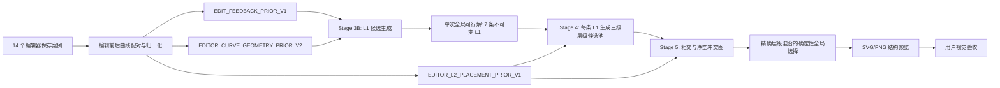

# 旧主线编辑器反馈生成关键技术方案 V1

## 1. 结论与适用范围

本轮确认的方案不是 R 区域规划，也不是把人工修改后的 SVG 当作固定模板重放，而是把编辑器中的修改转成无坐标的统计证据，依次约束旧主线的 L1 曲率、BranchUnit 层级和 L2 净空。

- 视觉结论：2026-08-09，用户确认本轮 `proto_sw_1_3 / seed 4101-4103` 的整体视觉效果可以。
- 正式范围：旧主线的结构枝条生成，即 `P0/主干 -> L1 -> L2 -> 全局选择`。
- 当前输出：枝条骨架；不包含叶、芽、卷头和最终纹样渲染。
- 明确不使用：R 区域规划、固定 SVG 坐标模板、强制 support/wrap/balance 角色造型、固定 C/S 配额、视觉分数自动批准。
- 验收边界：本次视觉认可只覆盖验收包中的 SW1-3 三个案例，不自动等于五种原型或后续阶段全面冻结。

## 2. 本轮解决的核心问题

本轮按用户反馈依次处理三个问题：

1. 保留已经可接受的根位、长度和总体流向；
2. 让 L1 曲率来自编辑器示范中的实际修正，而不是人为猜测“更弯的 C 形或 S 形”；
3. 增加稀疏的 L2 层级，并根据编辑案例修正 L2 挂载过密和跨 Unit 拥挤。

角色标签只保留为兼容性元数据。生成器不要求每条枝必须承担 support、wrap、balance 或 ordinary 的明显造型职责，也不强制生成绕花关系。

## 3. 正式生产链



正式数据流是：

`输入主干与原型分析 -> 编辑反馈先验 -> L1 候选生成 -> L1 全局可行性选择 -> BranchUnit 候选生成 -> 跨 Unit 冲突图 -> 全局结构选择 -> 正式渲染`。

三个编辑先验都进入正式消费者，不只是写入 manifest：

| 编辑证据 | 正式消费者 | 对最终输出的作用 |
|---|---|---|
| `EDIT_FEEDBACK_PRIOR_V1.json` | Stage 3B | L1 数量、根位节奏、长度层次和空间边界 |
| `EDITOR_CURVE_GEOMETRY_PRIOR_V2.json` | Stage 3B | L1 的编辑前到编辑后几何修正 |
| `EDITOR_L2_PLACEMENT_PRIOR_V1.json` | Stage 4、Stage 5 | L2 挂载位置、双子枝间距、同 Unit 与跨 Unit 净空 |

## 4. 编辑数据表示

### 4.1 数据选择

- 每个 `prototype_id + seed` 只取最新一次已修改保存会话；
- 共 14 个编辑案例、5 种 SW 原型；
- 原始与编辑后均为 202 条活动曲线；其中 51 条被删除、51 条新增；
- 删除曲线不进入活动曲线统计；新增曲线作为编辑后的结构证据；
- 不要求人工补 support/wrap/balance/ordinary 标签。

### 4.2 禁止坐标模板重放

先验不保存可直接重放的绝对 SVG 坐标。所有统计都在曲线自身坐标系或 Unit 尺度下归一化：

- L1 几何相对自身根点—端点弦长归一化；
- L2 挂载使用父 L1 的弧长分数；
- 曲线间净空使用 Unit 宽度归一化；
- 原型专属统计不足时才回退到全局分布。

因此，同一编辑证据可以作用于不同根位、方向和长度的正式候选，而不是复制某一张示范图。

## 5. L1 曲率学习

### 5.1 曲率描述符

对单段三次 Bézier L1 提取四个无坐标描述符：

- `start_handle_chord_ratio`：起点控制柄长度 / 根端弦长；
- `end_handle_chord_ratio`：终点控制柄长度 / 根端弦长；
- `start_angle_abs_deg`：起始控制柄相对弦向的绝对偏角；
- `end_angle_normalized_deg`：末端控制柄在统一镜像方向下的偏角。

最新批次中有 98 条活动 L1，其中 90 条为单段三次 Bézier；能够严格配对的编辑前后单段曲线为 65 对。SW1-3 子集有 21 条活动 L1。

### 5.2 生成方式

正式候选不是直接从“最终曲线形状分布”抽样，而是：

1. 按根位、长度和总体流向构造原始 L1 候选；
2. 在原始描述符空间中寻找相近的编辑示范；
3. 应用该示范真实记录的 `edited - original` 修正量；
4. 重新构造候选并进入全局机械可行性判断；
5. 同一 Unit 内同一条示范修正最多复用 2 次，防止七条枝出现同一种僵硬弯法。

这里没有预设“必须几条 C、几条 S”。C/S 只是结果的视觉描述，不是生成配额。

### 5.3 L1 选择

- SW1-3 的目标 L1 数量为 7；
- 根位节奏来自编辑批次的原型统计；
- Stage 3B 只执行一次前向全局求解；
- 检查根位间距、L1-L1 相交与最低净空；
- 不进行视觉评分重试、不自动删枝、不事后修复；
- 被选中的 L1 在 Stage 4 和 Stage 5 中保持几何不可变。

## 6. BranchUnit 层级生成

### 6.1 每个 L1 的候选池

每条已冻结 L1 都提供三类结构候选，而不按角色硬编码：

- `L1-Only`：无 L2；
- `Y-C`：一个 L2；
- `Y-2C`：两个 L2。

候选池只负责提供结构可能性，不在 Stage 4 逐条挑选“最好看”的候选。

### 6.2 全局层级混合

编辑后的 98 条 L1 中，27 条无子枝、39 条有一个子枝、32 条有两个子枝。SW1-3 的 7 个槽位按这一结构比例取整为：

- 2 个 `L1-Only`；
- 3 个单 L2；
- 2 个双 L2。

Stage 5 用确定性约束回溯寻找第一组同时满足冲突图和精确层级计数的完整组合，而不是对多个视觉结果打分选优。

## 7. L2 挂载与拥挤控制

### 7.1 从编辑器学习的 SW1-3 证据

SW1-3 的已保存案例包含 26 条活动 L2：

- 单子枝挂载分数中位数：`0.484445`；
- 双子枝挂载间隔中位数：`0.233867`；
- 非父子曲线净空第 10 分位：`0.041459`；
- 双子枝曲线净空第 10 分位：`0.032306`。

### 7.2 Stage 4 的局部约束

- 单子枝挂载点从编辑后的单子枝挂载分布取样；
- 双子枝用编辑后的挂载中心与分离距离共同确定；
- V2 不再使用旧逻辑中“为躲花而尽量向远端移动挂载点”的后处理；
- 双子枝的整条曲线距离低于编辑样本第 10 分位时，候选直接判为机械不可行；
- 这一步不改变父 L1。

### 7.3 Stage 5 的全局约束

冲突图除曲线相交外，还检查不同 Unit 后代曲线的最小距离，并包含周期平移后的相邻重复。低于 SW1-3 编辑数据第 10 分位 `0.041459` 的候选对建立冲突边，不能同时被选中。

本轮三个最终选择的最小跨 Unit 后代净空分别为：

| Seed | L2 挂载中位数 | 两个双子枝挂载间隔 | 两个双子枝曲线净空 | 最小跨 Unit 后代净空 |
|---:|---:|---:|---:|---:|
| 4101 | 0.550033 | 0.235716 / 0.261603 | 0.035876 / 0.040114 | 0.078951 |
| 4102 | 0.550034 | 0.309453 / 0.215279 | 0.051187 / 0.035476 | 0.075037 |
| 4103 | 0.435723 | 0.209961 / 0.235716 | 0.037353 / 0.035117 | 0.073476 |

## 8. 反捷径与反事实验证

本轮不使用实现自报的 `consumed=true` 作为唯一证据。测试直接扰动先验或合同并观察正式产物：

- 改变 L1 长度倍率，正式 plan digest 和 L1 长度中位数随之改变；
- 把原始到编辑后的 L1 修正量减半，正式一次性全局求解变为不可行，证明修正确实参与候选几何；
- 平移 L2 挂载先验样本，正式候选的挂载序列与 inventory digest 改变，同时不可变 L1 保持一致；
- 把层级混合从 `2/3/2` 改为 `1/5/1`，正式选择结构和候选 ID 随之改变；
- 测试直接重算 L1 非相交、双子枝净空和跨 Unit 冲突边，不用角色或通过标签代替几何判断。

## 9. 验收与当前边界

自动测试只负责机械合法性和主链消费关系。视觉质量由人审：

- 生成 manifest 仍保持 `pending_visual_review`，避免程序自行批准自己；
- 用户本轮的视觉认可另存为独立的 `visual_approval.json`，并用 SHA-256 绑定实际看过的九个文件；
- 本次批准可作为这一轮代码与方案的 Git checkpoint，不自动批准未看过的原型和种子；
- 以后新增编辑案例时，应重新提取三个先验、重跑机械检查并重新进行视觉验收。

精简验收包位于：

`artifacts/reviews/old_mainline_editor_feedback_v1/`

## 10. 关键文件

- `extract_editor_curve_geometry_prior.py`：提取 L1 编辑前后几何修正；
- `extract_editor_l2_placement_prior.py`：提取 L2 挂载与净空分布；
- `EDIT_FEEDBACK_PRIOR_V1.json`：批次级数量、长度与层级统计；
- `EDITOR_CURVE_GEOMETRY_PRIOR_V2.json`：L1 无坐标几何先验；
- `EDITOR_L2_PLACEMENT_PRIOR_V1.json`：L2 挂载与净空先验；
- `global_l1_flow.py`：Stage 3B 正式 L1 生成与全局可行解；
- `branch_unit_grammar_v1.py`：Stage 4 候选池与 Unit 内净空；
- `stage5_global_unit_selection.py`：跨 Unit 冲突图与精确层级选择；
- `run_edit_feedback_branch_units_v2.py`：正式串联、渲染和 manifest；
- `test_dynamic_branch_stage3b_edit_feedback_v2.py`：L1 主链和反事实测试；
- `test_dynamic_branch_edit_feedback_hierarchy_v2.py`：层级、挂载、净空和选择测试。

## 11. 复现命令

以下命令从仓库根目录执行。需要用 `CHANZHI_FROZEN_INPUT_ROOT` 指向包含冻结 Stage 1/2/2.5/3A 输入的仓库；本机对应 `D:\sdxl\chanzhi_sw_clean`。

```powershell
$env:CHANZHI_FROZEN_INPUT_ROOT='D:\sdxl\chanzhi_sw_clean'
python experiments/branch_unit/dynamic/run_stage3b_l1_flow.py `
  --prototype proto_sw_1_3 `
  --seed 4101 --seed 4102 --seed 4103 `
  --output artifacts/runs/stage3b_old_mainline_editor_feedback_v1

python experiments/branch_unit/dynamic/run_edit_feedback_branch_units_v2.py `
  --stage3b-root artifacts/runs/stage3b_old_mainline_editor_feedback_v1 `
  --output artifacts/runs/old_mainline_editor_feedback_v1

python -m pytest -q tests/test_dynamic_branch_stage3b_edit_feedback_v2.py
python -m pytest -q tests/test_dynamic_branch_edit_feedback_hierarchy_v2.py
```
